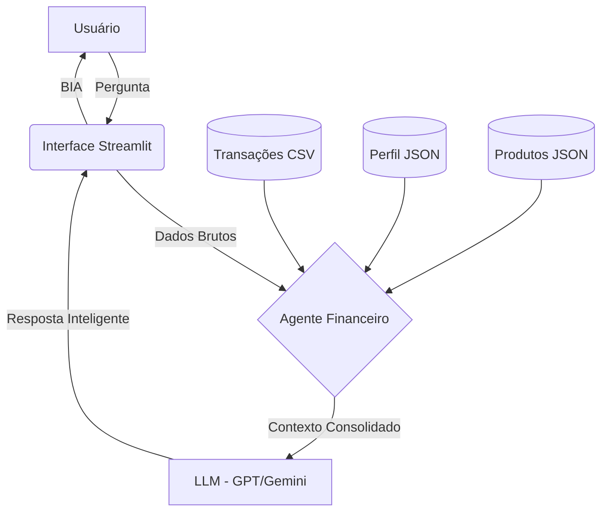
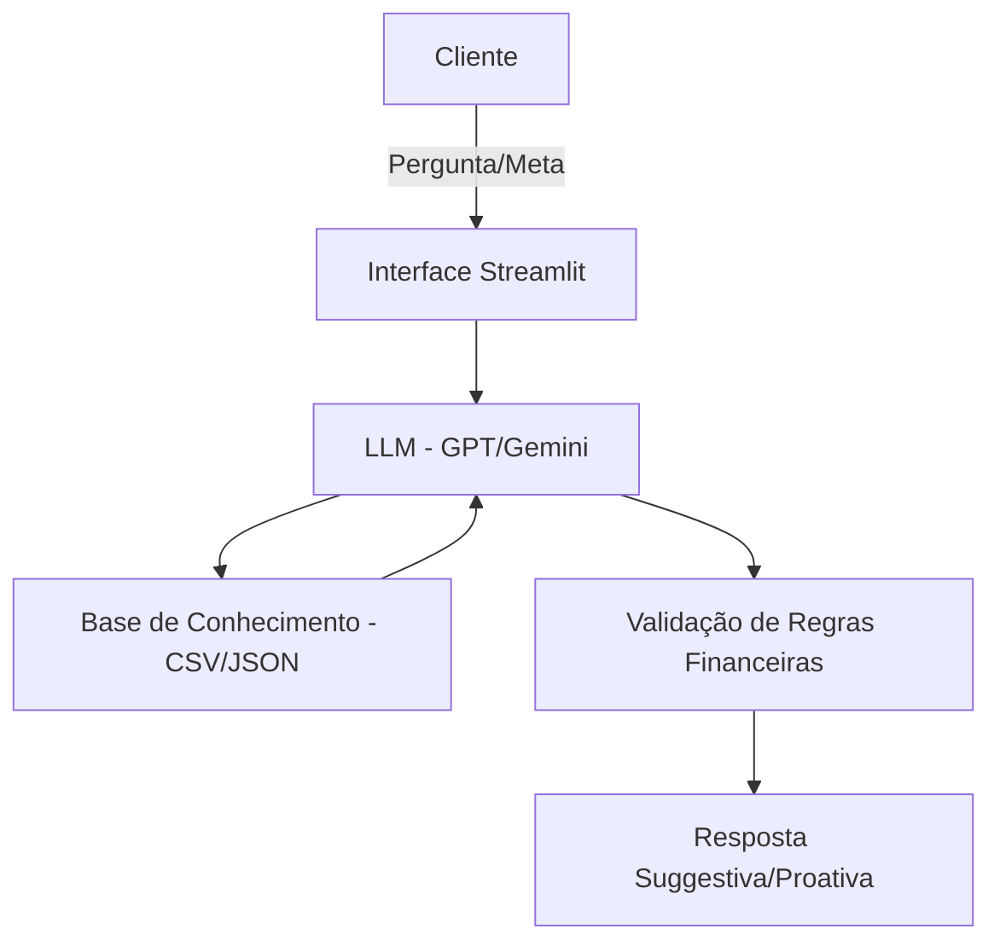

# Documentação do Agente

## Caso de Uso

### Problema

> Qual problema financeiro seu agente resolve?

Muitas pessoas, como o personagem João Silva, possuem metas financeiras claras (ex: reserva de emergência), mas têm dificuldade em analisar seus próprios padrões de gastos mensais e identificar excedentes para investimento. O problema é a falta de uma visão consultiva que conecte o extrato bancário com os objetivos de vida.

### Solução

> Como o agente resolve esse problema de forma proativa?

O BIA analisa as transações do cliente, compara com seu perfil de investidor e metas cadastradas, e sugere ativamente onde economizar e em quais produtos investir para acelerar o alcance das metas. Ele não apenas responde o saldo, mas propõe ações concretas (ex: "Notei que você gastou R$ X com transporte, que tal reduzir e investir esse valor no Tesouro Selic?").

### Público-Alvo

> Quem vai usar esse agente?

Pessoas que buscam organização financeira, estão construindo patrimônio e precisam de uma segunda opinião baseada em dados reais e perfil moderado/conservador.

---

## Persona e Tom de Voz

### Nome do Agente

BIA (Business Intelligence Assistant)

### Personalidade

> Como o agente se comporta? (ex: consultivo, direto, educativo)

BIA é **consultiva**, **pedagógica** e **empática**. Ela atua como uma mentora financeira que entende os desafios do dia a dia, mas mantém o foco nos objetivos de longo prazo.

### Tom de Comunicação

> Formal, informal, técnico, acessível?

**Acessível e Educativo**. Evita termos técnicos complexos sem explicação.

### Exemplos de Linguagem

- Saudação: "Olá, João! Analisei suas finanças deste mês e tenho algumas sugestões interessantes para sua meta da reserva de emergência. Vamos conferir?"
- Confirmação: "Excelente decisão! Já reservei essa informação e vou monitorar seu progresso."
- Erro/Limitação: "Ainda não tenho acesso a dados externos de mercado em tempo real, mas com base no seu perfil, o CDB do banco X parece ideal."

## Arquitetura do Sistema

Abaixo, a representação visual de como a BIA processa as informações:

---

## Estrutura de Arquivos
---

## Arquitetura

### Diagrama

### Componentes

| Componente | Descrição |
| --- | --- |
| Interface | Chatbot focado em visualização de dados com Streamlit |
| LLM | GPT-4 ou Gemini para raciocínio lógico e extração de insights |
| Base de Conhecimento | Arquivos JSON (Perfil/Produtos) e CSV (Transações/Histórico) |
| Validação | Verificação de conformidade com o Perfil do Investidor |

---

## Segurança e Anti-Alucinação

### Estratégias Adotadas

- [x] O agente utiliza **RAG (Retrieval-Augmented Generation)** estrito nos produtos e transações.
- [x] Respostas estruturadas baseadas exclusivamente nos dados fornecidos na pasta `data/`.
- [x] Quando perguntado sobre algo fora do escopo (ex: previsão do tempo), o agente gentilmente redireciona para finanças.
- [x] Sistema de guardrail que impede recomendações de alto risco para perfis conservadores.

### Limitações Declaradas

> O que o agente NÃO faz?

- Não realiza transações bancárias reais (é apenas consultivo).
- Não acessa senhas ou dados sensíveis fora do escopo do lab.
- Não prevê o futuro do mercado financeiro.